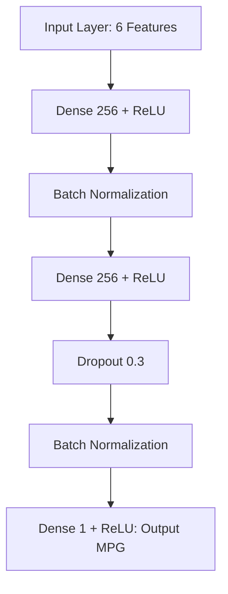

# Auto-MPG Fuel Efficiency Prediction using TensorFlow

A Deep Learning project that predicts automotive fuel efficiency (Miles Per Gallon - **MPG**) from vehicle mechanical specifications using TensorFlow and Keras.

---

## 📌 Project Overview

This repository contains a deep learning regression pipeline built using TensorFlow and Keras to estimate vehicle fuel economy (`mpg`). The model learns non-linear relationships between vehicle attributes (such as engine cylinders, horsepower, vehicle weight, acceleration, model year, and origin) and fuel efficiency.

### Key Objectives
- **Data Preprocessing & Cleaning:** Handle missing and placeholder values (`?`), cast proper datatypes, and eliminate multicollinear features.
- **Data Pipeline:** Build performant input streaming using `tf.data.Dataset` with batching and prefetching.
- **Deep Learning Model:** Train a multi-layer deep neural network (DNN) with Batch Normalization and Dropout regularization for regression.
- **Model Evaluation & Artifacts:** Track training loss (MAE) and Mean Absolute Percentage Error (MAPE), generate visualization plots, and serialize the trained model artifact.

---

## 📂 Project Structure

```
mlops/
├── auto-mpg.csv                                             # Auto-MPG Dataset
├── Predict_Fuel_Efficiency_Using_Tensorflow_in_Python.ipynb # Jupyter Notebook containing EDA & experimentation
├── main.py                                                  # Standalone Python script for end-to-end execution
├── requirements.txt                                         # Python package dependencies
├── outputs/                                                 # Generated artifacts directory
│   ├── fuel_efficiency_model.keras                          # Trained Keras model artifact
│   └── training_history.png                                 # Training vs Validation loss & MAPE curves
└── README.md                                                # Project documentation report
```

---

## 📊 Dataset Description

The dataset used is the classical **Auto-MPG dataset** (`auto-mpg.csv`) consisting of 398 vehicle records with 9 features:

| Feature | Type | Description |
|---|---|---|
| `mpg` | Continuous | Target variable: Fuel efficiency in Miles Per Gallon |
| `cylinders` | Discrete | Number of engine cylinders (3, 4, 5, 6, 8) |
| `displacement` | Continuous | Engine displacement in cubic inches (dropped during preprocessing) |
| `horsepower` | Continuous | Engine horsepower rating |
| `weight` | Continuous | Vehicle weight in lbs |
| `acceleration` | Continuous | Time to accelerate from 0 to 60 mph (seconds) |
| `model year` | Discrete | Model year of manufacture (70 to 82) |
| `origin` | Categorical | Country of origin (1: USA, 2: Europe, 3: Japan) |
| `car name` | String | Vehicle model name (excluded from input features) |

---

## ⚙️ Data Preprocessing Pipeline

1. **Cleaning Missing Values:** The `horsepower` column contains `'?'` entries for 6 records. These rows are filtered out, and the column is cast to integer type.
2. **Multicollinearity Elimination:** `displacement` exhibits high correlation (> 0.90) with `cylinders` and `weight`. To avoid redundant features, `displacement` is dropped.
3. **Train-Validation Split:** 80% training data, 20% validation data with a fixed `random_state=22`.
4. **tf.data Pipeline:** Batched into batches of size 32 with dynamic `AUTOTUNE` prefetching.

---

## 🧠 Model Architecture

The neural network is built with a sequential deep architecture configured for regression:



- **Loss Function:** Mean Absolute Error (`mae`)
- **Optimizer:** Adam Optimizer
- **Evaluation Metric:** Mean Absolute Percentage Error (`mape`)
- **Total Parameters:** ~70,000+ trainable parameters

---

## 🚀 How to Run the Project

### 1. Prerequisites
Ensure you have Python 3.10 - 3.12 installed.

### 2. Environment Setup
Create and activate a virtual environment:

```bash
# Using standard venv
python -m venv .venv
.venv\Scripts\activate      # On Windows
# source .venv/bin/activate # On Linux/macOS

# Install dependencies
pip install -r requirements.txt
```

*(Alternatively with `uv`: `uv pip install -r requirements.txt`)*

### 3. Run the Training Pipeline
Execute `main.py`:

```bash
python main.py
```

This will:
1. Load and clean `auto-mpg.csv`.
2. Construct train and validation `tf.data` pipelines.
3. Train the model for 50 epochs.
4. Output evaluation metrics on the validation dataset.
5. Save the trained model to `outputs/fuel_efficiency_model.keras`.
6. Save loss and error curves to `outputs/training_history.png`.

---

## 💻 Interactive Vehicle Mileage Prediction Web Application

A standard high-contrast **Black & White** Web UI is included in the project, allowing users to select vehicles from a database of over 300 cars or configure custom vehicle specifications with dropdowns and sliders.

### ✨ Web Application Features

1. **Monochrome High-Contrast Theme (No Emojis):**
   - Clean, professional Black & White visual aesthetic.
   - High-contrast dropdown menus with explicit background and text styling for optimal readability across all browsers and operating systems.

2. **Full Year Range (1970 – 2026):**
   - Supports vehicle model years from **1970 up to 2026**.

3. **Fuel Type & Ethanol Blending:**
   - **Fuel Type:** Select between **Petrol** and **Diesel**.
   - **Petrol Ethanol Blends:** Choose between **E0** (Pure Petrol), **E10** (10% Ethanol Blend), and **E20** (20% Ethanol Blend).

4. **Indian Rupee (₹ INR) Running Cost Analytics:**
   - Primary metric: **Predicted Mileage (km/L)**, along with **MPG** and **L/100km**.
   - Running cost calculations in **Indian Rupees (₹)**:
     - Running Cost per km (`₹ / km`)
     - Estimated Monthly Fuel Expense (`₹ / month`)
     - Estimated Annual Fuel Expense (`₹ / year`)

5. **Preset Car Database (Auto-Fill):**
   - Auto-fills specifications from 300+ car models (*Ford, Chevrolet, Toyota, Datsun, Volkswagen, etc.*).

---

## 🚀 How to Run the Web Application

### 1. Start the Application Server
Run the FastAPI backend with Uvicorn:

```bash
python app.py
```
*(or `.venv\Scripts\python.exe -m uvicorn app:app --host 127.0.0.1 --port 8000`)*

### 2. Access the UI
Open your browser and navigate to:
```
http://127.0.0.1:8000
```

---

## 📈 Results & Key Observations

- **Training Performance:** Training Loss (MAE) consistently decreases across 50 epochs down to ~3.5 MPG (MAPE ~16%).
- **Artifacts Saved:**
  - `outputs/fuel_efficiency_model.keras`
  - `outputs/training_history.png`
- **Observations & Recommended Improvements:**
  - **Feature Normalization / StandardScaler:** Features (`weight` ~3000, `horsepower` ~100, `cylinders` ~4-8) have substantially different scales. Adding a `keras.layers.Normalization()` layer or `sklearn.preprocessing.StandardScaler` improves convergence and validation stability.
  - **Early Stopping:** Adding `keras.callbacks.EarlyStopping(monitor='val_loss', patience=10)` prevents overfitting.
